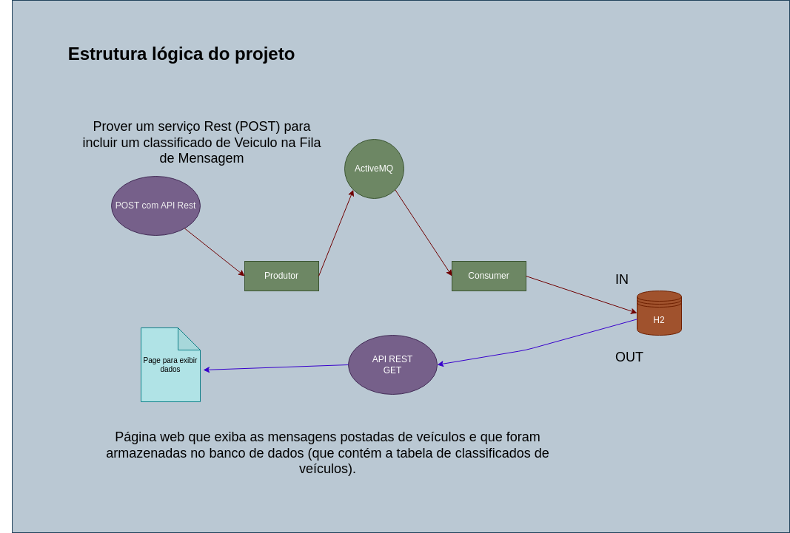

# Tecnologias: Java, ActiveMQ, API Rest(spring boot) e Banco H2
# Projeto: Classificados de veículo em Java com Spring Boot, usando Filas com o ActiveMQ, integração com DB H2 e criação de API REST para compartilhamento de dados.

 

O projeto está dividio em 2:
* Fila_ActiveMq_Veiculos_v3.
* apiRestSitemas-main.

## Funcionamento:
### Objetivo de Fila_ActiveMq_Veiculos_v3: 
1. Enviar dados de um veículo via console para uma fila ActiveMQ.
2. Receber dados através de um consumer 
3. Guardar informações em uma tabela chamada VEICULO no DB H2.

### Objetivo de apiRestSitemas-main.: 
1. Enviar dados de um veículo via Post para uma fila ActiveMQ, usando uma API REST.
2. Os dados são retirados da fila e armazenados em uma tabela chamada VEICULO no DB H2.
4. Através uma page WEB e uma solicitação a uma API REST os dados dos veículos cadastrados no Banco podem ser visualizados.

## Execução:
### Execução Fila_ActiveMq_Veiculos_v3: 
1. Para executar corretamente, você precisa ter o Banco H2 e o middleware ActiveMQ já baixados
Links para download: [ActiveMQ](https://activemq.apache.org/components/classic/download/) e [BD H2](https://www.h2database.com/html/main.html);
2. Execute o ActiveMQ. As instruções de execução podem ligeiramente variar dependendo do sistema operacional, ver o link [Installation ActiveMQ](https://activemq.apache.org/installation)
3. Abra os projetos Fila_ActiveMq_Veiculos_v3 e apiRestSitemas-main na IDE de sua preferência. Nosso projeto foi feito no [Netbeans](https://netbeans.apache.org/download/index.html);
4. Agora Execute o "ProducerFila.java" e popule a tabela;
5. Gerencie a fila de mensagens via página web, no endereço localhost:8161. Login:Admin e Senha:Admin ; 
6. Execute o lado Consumer, arquivo "ConsumerFila.java", e verifique o status das mensagens no mesmo endereço do passo anterior;
7. Abra o H2 no navegador, localhost:8082 e verifique os dados gerados na tabela "VEICULO";

### Execução apiRestSitemas-main:
1. Para executar esse projeto vamos precisar das seguintes ferramentas:
* [ActiveMQ](https://activemq.apache.org/components/classic/download/) e [BD H2](https://www.h2database.com/html/main.html);
* [Postman](https://www.postman.com/downloads/) para gerar um post de entrada na filaMQ;
* E instalar uma extenção no navegador chamada [CORS Unblock](), para entender melhor o motivo ver o artigo sobre [Plugin do Chrome: Resolvendo o CORS em desenvolvimento](https://rodolfofadino.com.br/plugin-do-chrome-resolvendo-o-cors-em-desenvolvimento-e0d0a5703019);
2. Execute o ActiveMQ. As instruções de execução podem ligeiramente variar dependendo do sistema operacional, ver o link [Installation ActiveMQ](https://activemq.apache.org/installation);
3. Abrir Postman e enviar um POST para o endereço e a seguinte mensagem json:
URL: localhost:8080/veiculo
Ex. Mensagem json: {"nomeCliente":"a", "modeloVeiculo":"b", "anoVeiculo":"c", valorVeiculo":"d","dataCadastro":"e"}
4. Verificar fila ActiveMQ, no endereço localhost:8161. Login:Admin e Senha:Admin ;
5. Executar o arquivo "AppJpaApplication.java", pra consumir a mensagem da fila e enviar para o BD no H2.
6. Para visualizar os dados no DB, executar arquivo veiculos.html, no diretorio raiz de "apiRstSistemas-main". E serão recuperados e mostrados os dados presentes no DB, via API rest.

### Melhorias Futuras:
* Fazer page para entrada e recuparação de dados, com JS e CSS considenrando UX e UI.
* Fazer teste com Domínios roteáveis.

### Sobre os autores
**[Israel Costa](https://github.com/israel1608)** e **[Flávia Campos](https://github.com/Fncampos)**

&nbsp;
**Este projeto é parte de uma atividade acadêmica do Curso Tecnologia em Análise e Desenvolvimentode Sistemas - IFPA - 3º semestre - matéria Sistemas distribuidos, ministrada pelo [Profº Cláudio Martins](https://github.com/cmartins-ifpa)**

